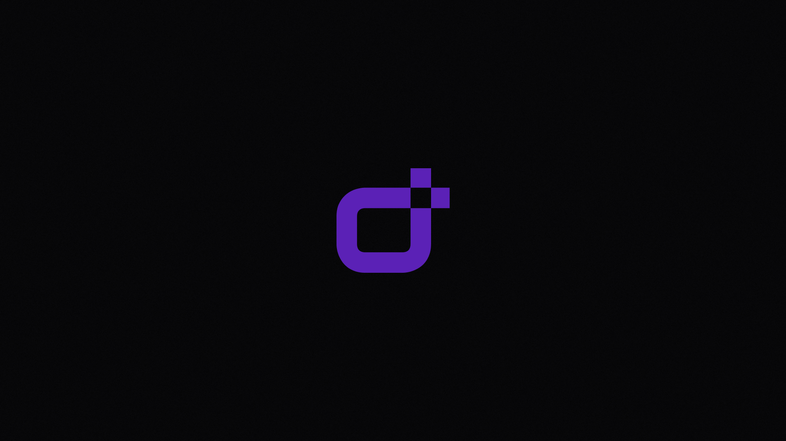

# davilacerda.com

My portfolio built with Next.js, TypeScript, Tailwind CSS and shadcn/ui.



## Technologies 👾

* [NextJS](https://nextjs.org/)
* [Typescript](https://www.typescriptlang.org/)
* [Tailwind](https://tailwindcss.com/)
* [shadcn/ui](https://ui.shadcn.com/)

## Getting started 🚀

### Clone Repository 👩‍💻

Clone the project on your computer and see how it works

```
  git clone https://github.com/DaviLacerda/davilacerda.com.git
  cd davilacerda.com
```

After that, to run project, run this commands:

##### yarn
```
  yarn install
  yarn start
```

## Deployment

Visit https://davilacerda.com/ to view the website.
